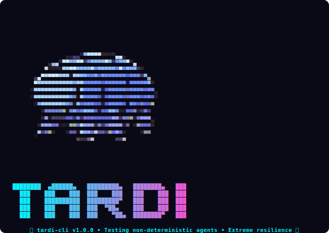
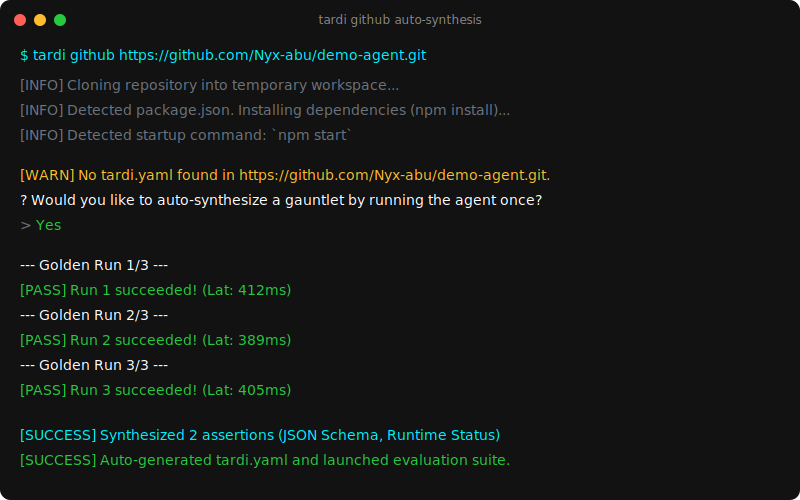
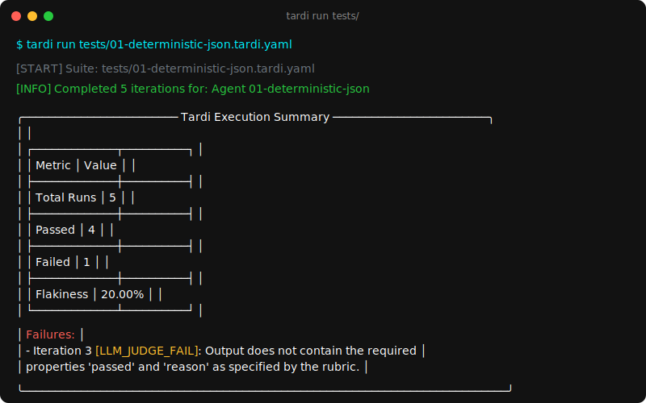
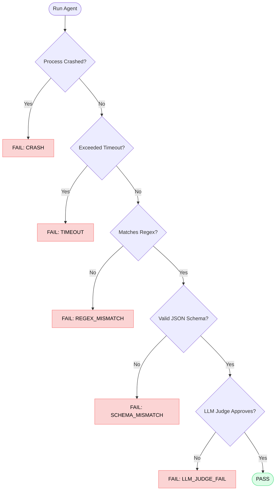

<p align="center">
  
</p>

<h1 align="center">Tardi</h1>

<p align="center">
  <strong>Deterministic testing for LLM agents and non-deterministic pipelines.</strong>
</p>

<p align="center">
  <a href="https://npmjs.com/package/tardi-cli"></a>
  <a href="LICENSE"></a>
  <a href="https://github.com/Nyx-abu/tardi/actions"></a>
</p>

<p align="center">
  <a href="#about">About</a> •
  <a href="#features">Features</a> •
  <a href="#installation">Installation</a> •
  <a href="#quickstart">Quickstart</a> •
  <a href="#writing-tests">Writing Tests</a> •
  <a href="#evaluation-pipeline">Evaluation Pipeline</a>
</p>

---

<p align="center">
  
</p>

<p align="center">
  
</p>

Tardi is an open-source testing framework engineered specifically for evaluating agentic workflows, autonomous LLM scripts, and non-deterministic applications. 

## About

Testing AI agents presents a unique challenge: traditional testing frameworks cannot evaluate non-deterministic natural language outputs, and raw "LLM-as-a-judge" evaluation pipelines are prohibitively expensive and prone to hallucination at scale.

**Tardi solves this by implementing a tiered assertion gauntlet.** Instead of blindly sending every agent execution trace to an evaluation model, Tardi enforces strict deterministic constraints first. If your agent crashes, hangs in an infinite loop, or returns malformed JSON, Tardi fails the test immediately—preventing unnecessary LLM API calls and accelerating your feedback loop.

## Features

- **Tiered Evaluation Engine:** Catch process crashes, timeouts, and schema mismatches deterministically before triggering expensive LLM judges.
- **Concurrency & Rate-Limiting:** Execute test suites in parallel with intelligent chunking to maximize throughput without exceeding API rate limits.
- **Provider Agnostic:** Built on the standard Vercel AI SDK, Tardi supports hot-swappable evaluation models from OpenAI, Google, Anthropic, and local endpoints.
- **Interactive REPL & Natural Language CLI:** Includes a zero-friction CLI environment for rapid test synthesis, execution, and debugging, powered by an onboard NLP intent parser.
- **Secure Credential Management:** Safely stores provider API keys in your native OS keychain during local development.

## Installation

Install the CLI globally via npm to use the `tardi` command anywhere:

```bash
npm install -g tardi-cli
```

## Quickstart

1. **Initialize Tardi in your repository:**
   ```bash
   tardi init
   ```
   This will generate a `tardi.yaml` configuration file and prompt you to select your preferred evaluation provider.

2. **Authenticate with an LLM provider:**
   ```bash
   tardi auth login google
   ```
   Tardi securely stores your API key using your native OS keychain.

3. **Run your agent test suites:**
   ```bash
   tardi run tests/
   ```

## Writing Tests

Tardi utilizes simple YAML files (`*.tardi.yaml`) to define test suites. You can specify concurrency constraints, iteration counts, execution timeouts, and a multi-layered assertion stack.

```yaml
# tests/example.tardi.yaml
name: Agent JSON Output Test
command: node path/to/your/agent.js
iterations: 5
concurrency: 2
timeoutMs: 30000

# 1. Deterministic assertions execute first
assertions:
  jsonSchema:
    type: object
    required: ["status", "result"]
  regex: "\"status\":\\s*\"(success|failure)\""

# 2. LLM Judge evaluates the final semantic intent
evaluator:
  provider: google
  model: gemini-2.5-flash
  prompt: |
    Evaluate if the agent successfully summarized the input document.
    Return only 'PASS' or 'FAIL'.
```

## Evaluation Pipeline

When you execute an iteration, Tardi evaluates the agent's output through a strict, cost-saving pipeline:



## CI/CD Usage

Tardi detects continuous integration environments automatically and disables interactive prompts. Inject API keys directly via environment variables for your pipeline:

```bash
GOOGLE_GENERATIVE_AI_API_KEY="your-key-here" tardi run tests/
```

## Contributing

Pull requests are welcome. For major architectural changes, please open an issue first to discuss your proposed modifications.

Please see our [Contributing Guide](CONTRIBUTING.md) and our [Code of Conduct](CODE_OF_CONDUCT.md).

## License

This project is licensed under the [ISC License](LICENSE).
